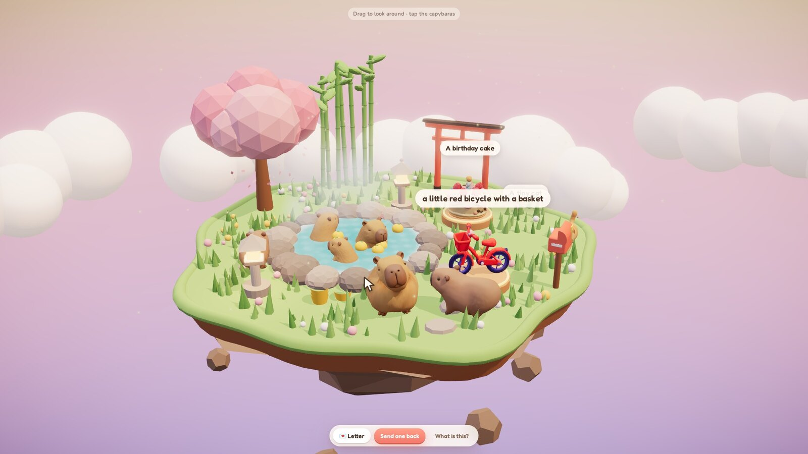

# 📮 Capy Post — send someone a tiny world

**Tripothon S1 · Theme: "Build a world as a Gift"** · Direction track: **App** · Tool track: **Tripo**

Tell Capy Post who a gift is for and three things they love. A crew of capybaras builds them a tiny 3D world — a floating hot-spring island with their things in it — wraps it in a gift box, and delivers it as a link. The recipient taps the box, the ribbon unties, the walls fall open, a whole world grows out of it, and a capybara hands over your letter.

Every capybara and every gift object is generated with **Tripo** (text-to-3D). The animals are auto-rigged and animated by Tripo too: a four-legged capybara and a cat that walk, and a host capybara rigged as a biped who greets you and dances. The island itself (rocks, trees, torii, lanterns, gift box) is procedural three.js. Anything the sender types gets sculpted live by Tripo while the capybaras haul crates.

- **Live demo:** _add your Vercel URL here after deploying (see [Deploy](#deploy))_
- **Walkthrough video:** [`submission/capy-post-walkthrough.mp4`](submission/capy-post-walkthrough.mp4)
- **Visual asset board:** [`submission/asset-board.png`](submission/asset-board.png)
- **Submission copy:** [`submission/SUBMISSION.md`](submission/SUBMISSION.md)



## The experience

1. **Build** (`/#/create`): who it's for, a world (Capybara Onsen · The Moon's Dark Side · The Kid You Used to Be), three things they love, a letter. Pick from the "capy shelf" (pre-made Tripo models, instant) or type anything to have Tripo sculpt it live.
2. **Watch the crew** while Tripo generates: worker capybaras carry crates around the island; each crate pops into the finished model.
3. **Wrap it** and get a link. The whole gift lives in the URL; there's no account or database.
4. **Unwrap** (`/#/g/…`): tap the box, the world grows out of it, the host capybara greets you, and the letter types itself out. Drag to look around, poke the soaking capybaras, tap gifts to read their notes, then *send one back*.

Judges land on a pre-built gift addressed to them ("You've opened a lot of demos today…"), so there's zero waiting.

## How Tripo is used

| Where | Tripo API | Details |
|---|---|---|
| All characters & gift objects | `POST /v3/generation/text-to-model` (`v3.1`) | 11 library models with one shared style prompt so they read as one toy set |
| Walking capybara, cat | `rig-check` → `rig` (`v2.5`, `rig_type: quadruped`) → `retarget` (`preset:quadruped:walk`, in place) | We drive locomotion along paths around the island |
| Host capybara | `rig` (`v1.0` biped) → `retarget` with 5 presets in one batch (greet, dance, walk, relax, cheer) | Tripo returns them as one 12-second performance; we restart it on the reveal so the greeting lands as the letter opens |
| Live gifts | text-to-model with texture `v3.5` `fast` + `face_limit 8000` | Generated on demand from what the sender types, polled for progress |
| Gift persistence | `GET /v3/tasks/{id}` | `/api/model` streams the GLB through our origin (Tripo's CDN sends no CORS headers) with long edge caching, so links keep working after signed URLs expire |

A happy accident: our first capybara came out as an upright plush, and `rig-check` called it a **biped**. Instead of fighting it, it became the host character, which gave us Tripo's 90+ biped animation presets.

Asset generation is one resumable script: [`scripts/generate-assets.mjs`](scripts/generate-assets.mjs) (task ids in [`scripts/gen-state.json`](scripts/gen-state.json)).

## Tech

- React 19 + React Three Fiber + drei + postprocessing (bloom, vignette, ACES tone mapping)
- Procedural island, onsen water shader, steam, petals, gift box with an unwrap timeline
- Vercel functions (`/api/*`) keep the Tripo key server-side: `health`, `generate`, `task`, `model`, `preview`
- Gifts are LZ-compressed JSON in the URL hash, so nothing is stored
- ElevenLabs: background music, all sound effects, and the video narration
- The walkthrough video is a deterministic capture of the real app: virtual clock + R3F `frameloop="never"` + CDP screenshots ([`capture/`](capture/))

## Run locally

```bash
npm install
TRIPO_API_KEY=tsk_... npm run dev     # live generation on; without a key the app uses the capy shelf
```

## Deploy

1. Merge this branch into `main` (or set it as the Production Branch in Vercel).
2. On [vercel.com/new](https://vercel.com/new), import the repo. The framework is detected as Vite.
3. Add the environment variable `TRIPO_API_KEY`.
4. Deploy. `/api/health` should return `{"live":true}`.

Without `TRIPO_API_KEY`, everything still works: the create flow uses the pre-generated Tripo library.

## Regenerate things

```bash
TRIPO_API_KEY=... NODE_USE_ENV_PROXY=1 node scripts/generate-assets.mjs        # 3D library (≈345 credits)
ELEVENLABS_API_KEY=... node scripts/generate-audio.mjs                          # narration, music, sfx
npm run build && npx esbuild api/*.ts --bundle --platform=node --format=esm --outdir=.api-build
TRIPO_API_KEY=... node capture/serve.mjs 4173 &                                 # frozen build + api
BASE=http://localhost:4173 node capture/record.mjs                              # frames
node capture/assemble.mjs                                                       # → submission/*.mp4
```
